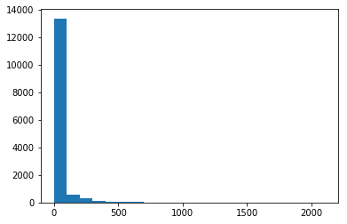
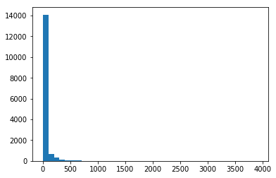

## Hubs and Authorities at Enron
#### Proposed Solution

The task is based on the estimation of the Hubs and Authorities in the Enron social graph. The analysis is performed with the HITS algorithm applied to a corpus of employee e-mails.

Each file contained in the e-mail dataset is a single message. When different MessageIDs are present is because they are present in forwarded e-mails. 
A first glance on the dataset is performed looking only to the fields "From:" and "To:", creating links between a sender and multiple receivers only if they have Enron accounts (Enron accounts with partial e-mail are removed, e.g., <email yl.j@enron.com).

Inserting the "cc:" field makes little change to the number of receivers from 14201 to 15128. Nevertheless, the average of received messages grows from 30.77 to 35.74 when "cc:" is considered. Moreover, the distribution of received messages appears to have a longer tail, that could be explained as individual employees that are often included in "cc:".

The carbon copy field can be used in a broad spectrum of different situations: when a mail is spread to a whole group, allowing a "Reply All" feature, or to a supervisor or department manager, showing a hierarchy relation. Two different analysis, including or excluding "cc:", are carried out, showing different results for Hub and Authorities.
These results could confirm the role of "cc:" in shaping different hierarchies in a social network. 

The "bcc:" field has a more challenging interpretation: it can be used to mask long lists of recipients, like in a newsletter, or, more rarely, to hide some accounts in a conversation. For this reason, and with little change in the final results when considered, the field "bcc:" is not considered. 

### HITS RESULTS

The HITS algorithm implemented for this task is a weighted version of the original. The Hub and Authority formulas are changed to consider the weights of the edges as the number of excanged e-mails between sender and receiver. 

Is possible to implement this weigthed HITS algorithm using directly an adjacency matrix; due to the sparsity of the obtained adiacency matrix from the data corpus, the used graph was implemented with a dictionary of sets wich, where each sets are the outbound links of a node, and the weights are stored in the adjacency matrix as a dictionary with tuples (sender,receiver) as keys.

In the next tables result are reported for top-5 hubs and authority with and without the field "cc:"

##### Results obtained without "cc:"
| TOP HUBS                    | TOP AUTHORITY     |
| -------------               | -------------     |
| lorna.brennan@enron.com     | tk.lohman@enron.com     |
| veronica.espinoza@enron.com     | lorraine.lindberg@enron.com    |
| rhonda.denton@enron.com    | lindy.donoho@enron.com    |
| jeff.dasovich@enron.com      | kevin.hyatt@enron.com     |
| kay.mann@enron.com     | michelle.lokay@enron.com      |

##### Results obtained with "cc:"
| TOP HUBS                    | TOP AUTHORITY     |
| -------------               | -------------     |
| pete.davis@enron.com   | mark.guzman@enron.com    |
| bill.williams@enron.com     | ryan.slinger@enron.com   |
| rhonda.denton@enron.com    | geir.solberg@enron.com   |
| l..denton@enron.com      | craig.dean@enron.com     |
| grace.rodriguez@enron.com     | leaf.harasin@enron.com      |

## Find out ‘key’ words

The simplest way to extract disproportionately frequent words in messages between top hub and authorities could be based on the tf-idf calculated on two different sets of messages: one set is the set of messages exchanged between the top accounts, and the other its complement in the set of all messages. 

Problems could arise when the sizes of these two sets are too different
so that an unbiased comparison cannot be guaranteed. 
A better comparison set could be composed by sampling from a dense cluster of nodes to replicate the dynamics of a highly connected group, or from randomly selected messages, having the same cardinality of the top accounts' set.
To avoid marking words as infrequent only because the comparison set is not representative enough, the comparison with a random sample could be iterated.

